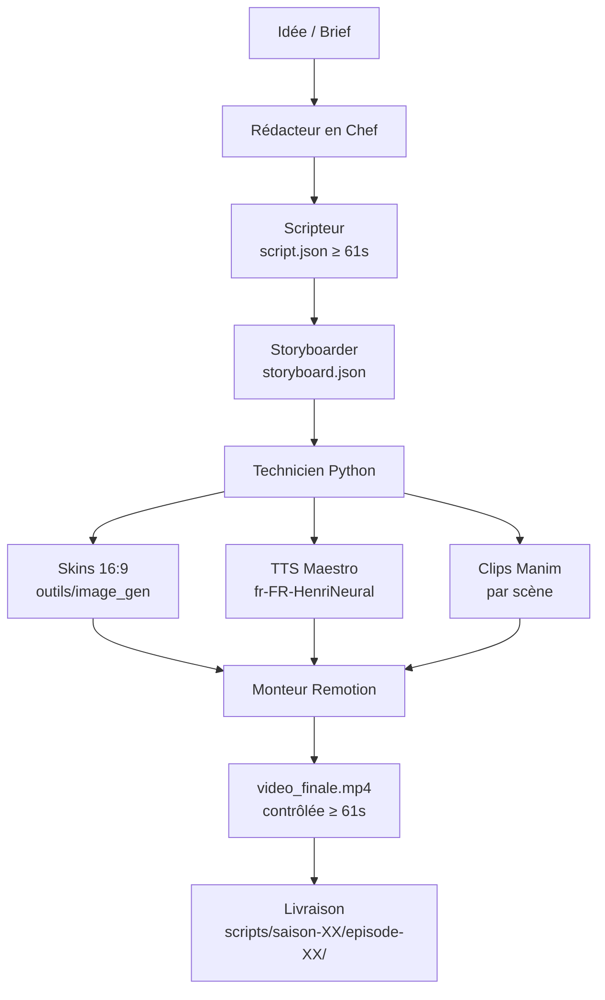

# Sol Universalis

Pipeline multi-agents pour la production de **courts-métrages pédagogiques animés** style *Il était une fois…* (Albert Barillé).

**Épisode pilote** : Saison 0 / Épisode 0 — *La fermentation malolactique*  
**Durée cible** : 61–75 secondes (monétisation Instagram / TikTok)

---

## Architecture technique (Option B)

```
┌─────────────────┐     ┌─────────────────┐     ┌──────────────────────┐
│  Python         │     │  Manim          │     │  React / Remotion    │
│  (skins + TTS)  │────▶│  (clips animés) │────▶│  (montage final)     │
└─────────────────┘     └─────────────────┘     └──────────────────────┘
```

| Couche              | Outil              | Responsabilité                                      |
|---------------------|--------------------|-----------------------------------------------------|
| Image brute / Skin  | **Python** (Pillow)| Personnages 16:9 déterministes, versionnés dans le repo |
| Animation           | **Manim**          | Clips animés (morphs, transformations, caméra, CO₂) |
| Montage final       | **Remotion**       | Assemblage clips + audio + timing précis + export   |

---

## Workflow visuel



---

## Structure du dépôt

```
sol-universalis/
├── AGENTS.md                 # Vue d’ensemble des agents
├── TODO.md                   # Suivi de l’épisode en cours
├── README.md                 # Ce fichier
├── agents/                   # Définition de chaque agent
│   ├── redacteur_en_chef.md
│   ├── scripteur.md
│   ├── storyboarder.md
│   ├── technicien_python.md
│   └── monteur.md
├── assets_design/
│   └── personnages/          # Skins + fiches d’identité
├── outils/                   # Scripts déterministes
│   ├── tts_maestro.py
│   ├── check_duration.py
│   ├── mux_audio.py
│   └── image_gen/
│       ├── generate_character.py
│       └── generate_all_skins.sh
├── references/               # Factories Manim + structure narrative
├── scripts/
│   └── saison-00/
│       └── episode-00/       # Pilote fermentation malolactique
└── studio_remotion/          # Projet React / Remotion
```

---

## Manuel d’utilisation (pour un autre agent)

### 1. Prendre la relève
1. Lire `AGENTS.md` et `TODO.md`
2. Lire les fiches dans `agents/`
3. Vérifier l’état des skins dans `assets_design/personnages/`
4. Respecter strictement l’ordre des agents

### 2. Règles non négociables
- Durée finale **≥ 61 secondes**
- Images de référence en **16:9 (1280×720)**
- Pure narration visuelle (pas de slides / sous-titres envahissants)
- Continuité des personnages via les skins Python + factories Manim
- Utiliser les scripts du dossier `outils/` (économie de tokens + reproductibilité)

### 3. Commandes utiles
```bash
# Générer tous les skins
bash outils/image_gen/generate_all_skins.sh

# TTS Maestro
python outils/tts_maestro.py --script scripts/saison-00/episode-00/script.json

# Contrôle durée
python outils/check_duration.py chemin/vers/video.mp4
```

### 4. Boucle d’amélioration (auto-learn)
Après chaque cycle (skins → storyboard → clips → montage) :
- Noter ce qui a fonctionné / ce qui manque dans `TODO.md` ou le skill
- Améliorer le générateur Python ou les factories Manim
- Mettre à jour les fiches personnages

---

## Leçons apprises (à ce jour)

1. **Grok Imagine** n’est plus utilisé pour les skins → tout doit être dans le repo (Python déterministe).
2. Séparer clairement **génération d’image** (Python), **animation** (Manim) et **montage** (Remotion) évite les doublons et facilite la reprise.
3. Les scripts déterministes dans `outils/` économisent des tokens et garantissent la reproductibilité.
4. La durée minimale de 61 s est une contrainte business (monétisation) → toujours vérifier avec `check_duration.py`.
5. Les skins procéduraux actuels sont volontiers simplistes (ligne claire géométrique). Ils servent de base stable ; on les enrichit par itération.

---

## Épisode en cours

**Saison 00 / Épisode 00** — Fermentation malolactique  
- Script : `scripts/saison-00/episode-00/script.json` (cible 68 s)
- Skins générés (en attente de validation)
- Prochaine étape : validation skins → storyboard → clips Manim → montage Remotion

---

*Dernière mise à jour : 2026-09-23*
